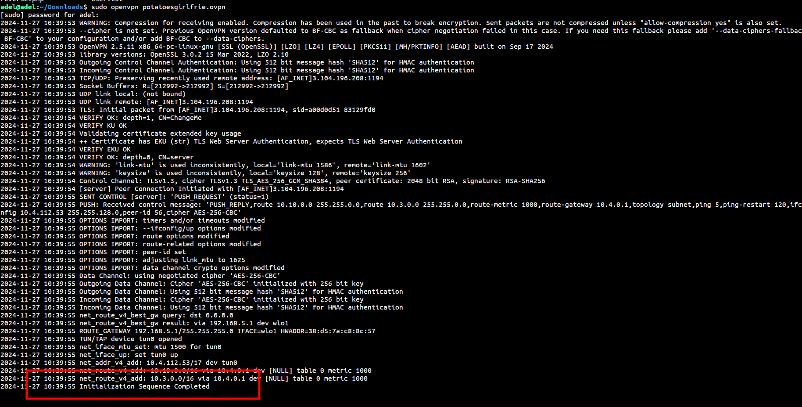
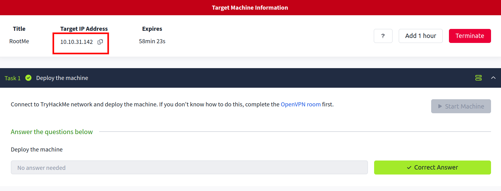
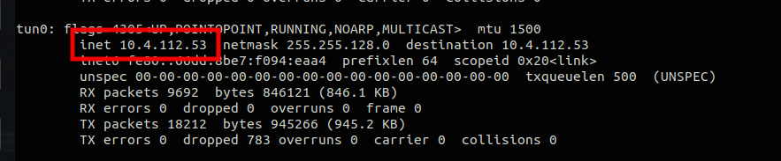

# Root Me

**A CTF for begginers!**

- **Step 1:  Get connected**

We need to connect to the TryHackMe network and deploy the machine to gain access to it.

To connect to THM network, you need to download the OpenVPN GUI open-source application and import your VPN configuration file.

Connecting with ``Linux``:

1. Download OpenVPN by running the following command in your terminal:

    ```bash
        sudo apt install
        sudo apt install openvpn
    ```

2. Locate the full path to your VPN configuration file (download from the [access](https://tryhackme.com/r/access) page), normally in your Downloads folder.

3. Use your OpenVPN file with the following command: 
 
    ```bash
        sudo openvpn /path-to-file/file-name.ovpn
    ```

4. And that's it! You should be successfully connected.




- **Step 2:  Start the machine**

Start the machine to get the ip.




- **Step 3:  Scanning the target NMAP**

1. Let's use Nmap to see how many ports are open and what protocols are running on them.


    ```bash
        sudo nmap -sS -sV <target-IP>
    ```

    `sudo` : Nmap requires root privileges to perform some advanced scans.

    `-sS` : Performs a TCP SYN scan, which is faster and less detectable.

    `-sV` : Detects service versions running on the open ports.


- **Step 4:  Scanning the target GoBuster**

    `Gobuster`: Gobuster is a command-line tool used for brute-forcing URLs and directories on websites, as well as DNS subdomains. It helps security analysts discover hidden content by testing a list of possible names quickly.

    ```bash
        sudo apt install
        sudo apt install gobuster
    ```

    `Dirb`: Dirb is a web content scanner that searches for hidden directories and files on a web server by brute-forcing a wordlist. It helps identify potential entry points for further security testing.

    ```bash
        sudo apt install dirb
    ```

    ```bash
        gobuster -u 10.10.31.142 -w /usr/share/dirb/wordlists/small.txt
    ```
    `-u` 10.10.31.142: Specifies the target IP address.

    `-w` /usr/share/dirb/wordlists/small.txt: Uses a wordlist (small.txt) from Dirb’s collection to test for hidden directories.


Then testing all directories to see if they are hidden.


- **Step 5:  Reverse shell**


Then, we create a `reverseshell.php5` file and upload it.
You can get the reverse shell code from here: [Reverse shell](https://github.com/pentestmonkey/php-reverse-shell.git)


Now that we have successfully uploaded the file, we should initiate the reverse shell by going to the uploads directory.


Before executing the PHP file, we should use   `nc` to listen for incoming requests on our VPN IP.

We should use the VPN IP to listen because we need to be on the same network. Since the machine is in the THM network, we must use the VPN.



`nc`: (Netcat) is a command-line tool used for creating TCP/UDP connections and listening on ports. It is commonly used for tasks like transferring data or setting up reverse shells.

```bash
    sudo nc -lvnp 86 -s 10.4.112.53
```


`sudo`: Runs the command with root privileges.

`nc`: Invokes the Netcat tool.

`-l`: Tells Netcat to listen for incoming connections.

`-v`: Enables verbose mode, providing more detailed output.

`-n`: Prevents DNS resolution (uses IP addresses directly).

`-p 86`: Specifies the port number (86) to listen on.

`-s 10.4.112.53`: Sets the source IP address to 10.4.112.53.


Here we are in our Target shell! =D

`NOTE`: In reverse shell no tabs and arrows, they are not working! =D


We can do any command we want, and explore the whole enviroment.


- **Step 6:  Exploring for data**


`SUID`: (Set User ID) is a special permission in Unix-like systems that allows a user to execute a file with the permissions of the file's owner, rather than the permissions of the user running the file. This is commonly used for programs that require elevated privileges, such as changing system configurations or accessing restricted resources.

Setting the SUID permission on `/usr/bin/python` is unusual and potentially risky, as Python normally doesn't need elevated privileges to run. If an attacker exploits this, they could gain root access by executing Python scripts with root privileges. 

`GTFOBins`: is a curated list of Unix binaries that can be exploited to escalate privileges or bypass security mechanisms. It includes tools that are commonly available on systems, such as find, vim, bash, and others, which, when misconfigured (e.g., with SUID permissions), can be used for privilege escalation or launching reverse shells. It's a valuable resource for penetration testers and attackers looking to leverage existing tools for privilege escalation.

here is a usefull site for gtfobins: `https://gtfobins.github.io/`


```bash
	python -c 'print(open("file_to_read").read())'
```


- **Conclusion**

This Root Me CTF walkthrough offers a step-by-step guide for beginners to engage with TryHackMe’s machine, starting from connecting to the network via OpenVPN to performing tasks such as scanning with Nmap, brute-forcing directories with GoBuster, and uploading a reverse shell for remote access.

- `VPN Connection`: Users connect to the TryHackMe network using OpenVPN, ensuring they can access the target machine securely.

- `Scanning with Nmap and GoBuster`: These tools help identify open ports, services, and potential hidden directories on the target system.
- `Reverse Shell Setup`: After uploading a reverse shell PHP script, the user listens for incoming connections using Netcat on their VPN IP.
- `Privilege Escalation`: Once inside the shell, the user explores potential vulnerabilities like SUID permissions and references resources like GTFOBins to escalate privileges.